# 基于Springboot的高校学科竞赛平台

## Springboot-0064


## 技术栈

Springboot mybatisplus vue mysql maven


## 数据库表(25张)


## 功能介绍

```properties
本高校学科竞赛平台有管理员，学生，领队老师，教师，

管理员功能有个人中心，教师管理，学生管理，领队教师管理，竞赛类型管理，竞赛信息管理，学院管理，专业管理，获奖情况管理，系统管理等。

教师功能有个人中心，题目类型管理，竞赛题库管理，竞赛类型管理，竞赛信息管理，报名信息管理，竞赛评分管理，参赛名单管理，晋级名单管理，获奖名单管理，竞赛总结管理，报销清单管理，成绩申诉管理，参赛信息管理，参赛信息管理，往年成绩管理，获奖情况管理。

领队老师功能有个人中心，题目类型管理，竞赛题库管理，竞赛类型管理，竞赛信息管理，报名信息管理，竞赛评分管理，参赛名单管理，晋级名单管理，获奖名单管理，竞赛总结管理，报销清单管理，成绩申诉管理，参赛信息管理，参赛信息管理，往年成绩管理，获奖情况管理。

学生功能有个人中心，竞赛题库管理，竞赛类型管理，竞赛信息管理，报名信息管理，竞赛评分管理，参赛名单管理，晋级名单管理，获奖名单管理，竞赛总结管理，报销清单管理，成绩申诉管理，参赛信息管理，参赛信息管理，往年成绩管理，获奖情况管理。
```


## 图片

### 前台


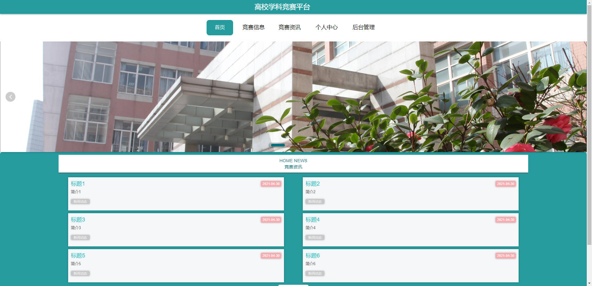


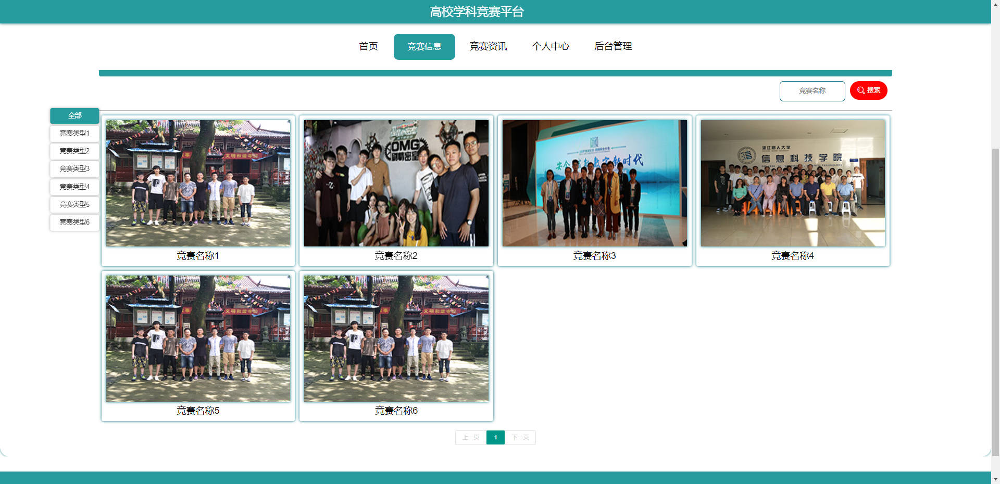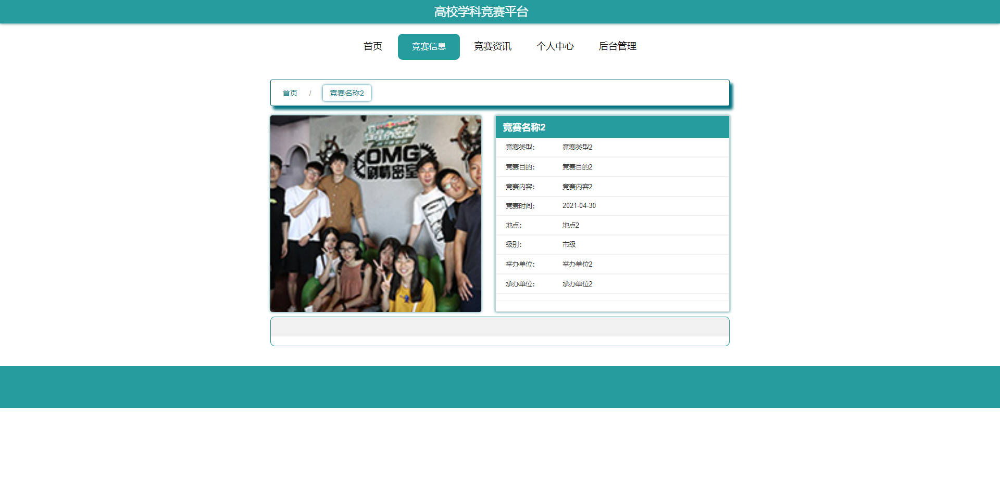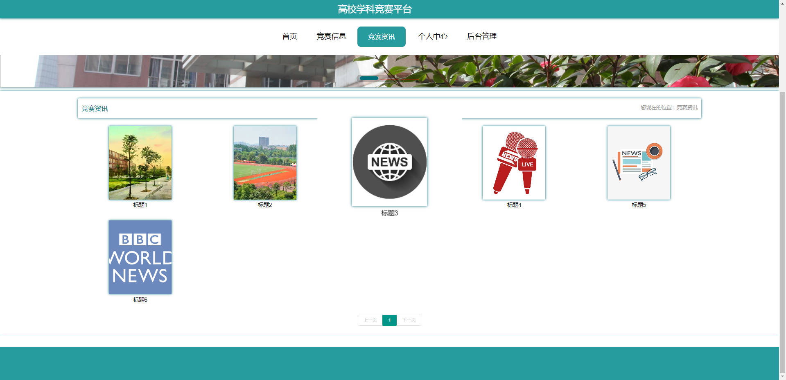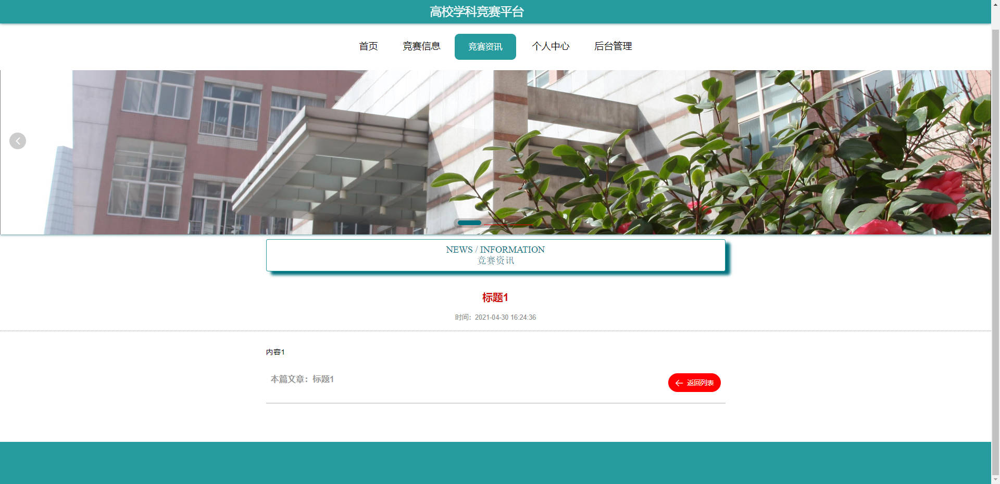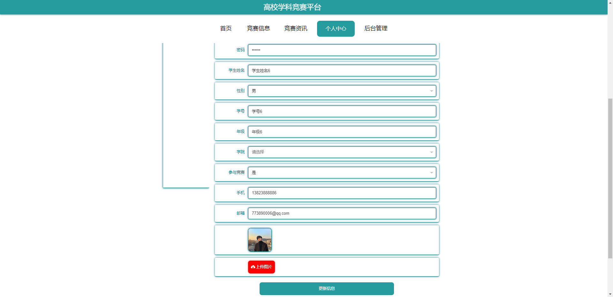

### 后台


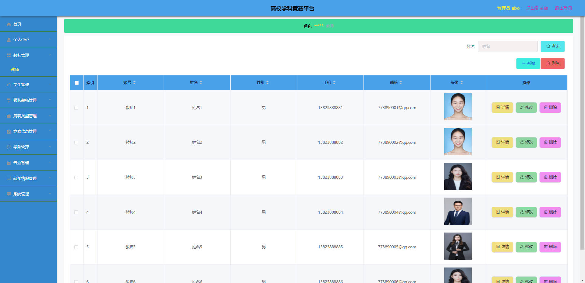

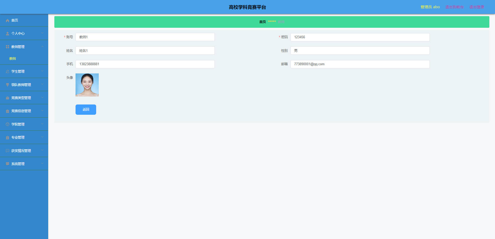

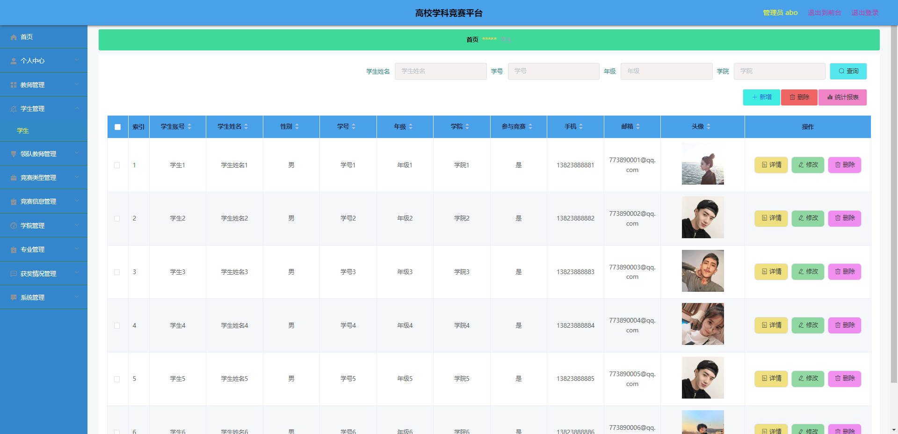

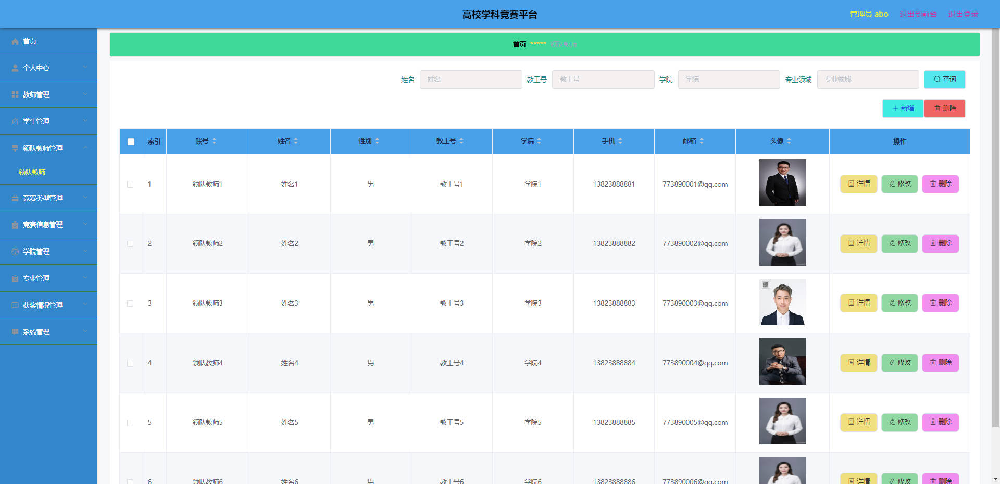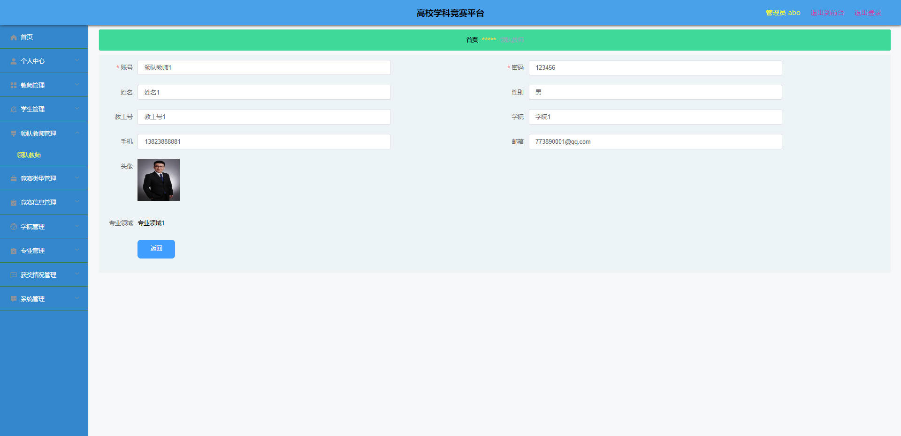

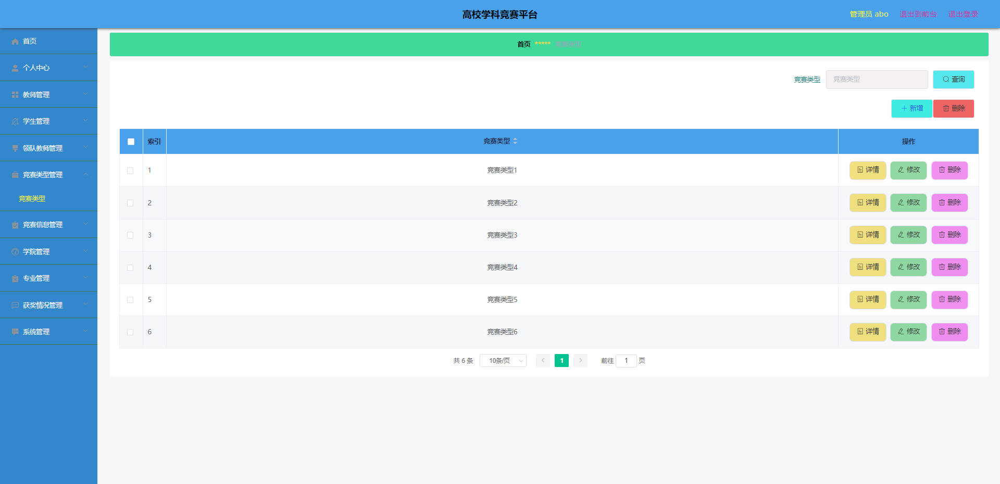

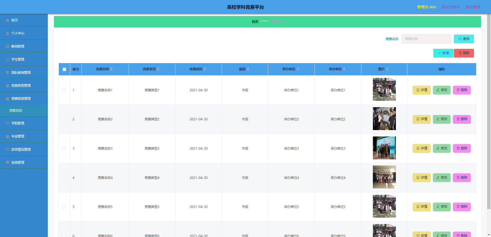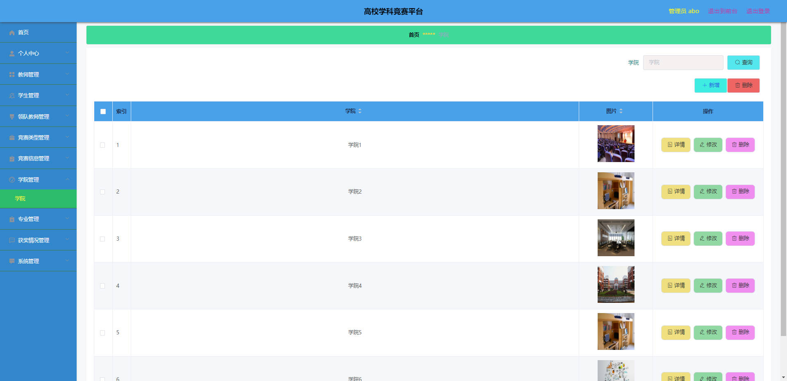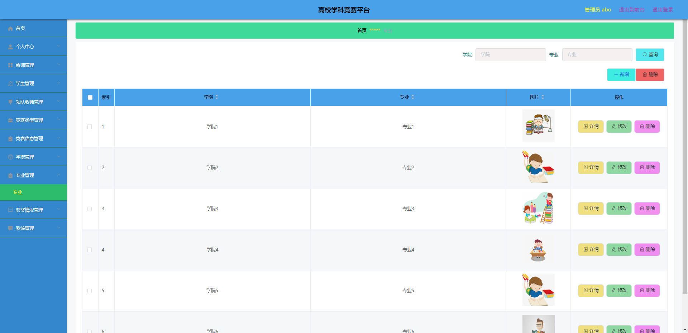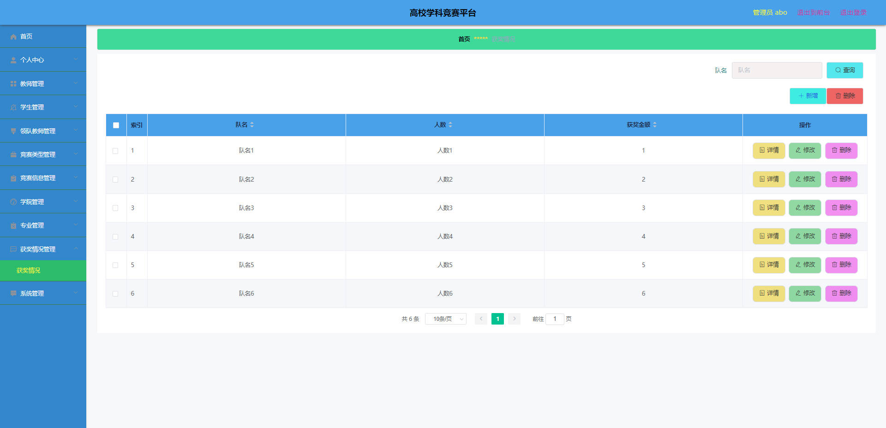

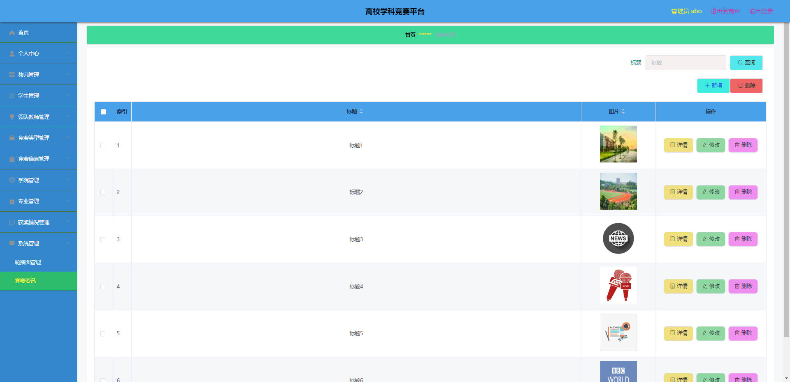

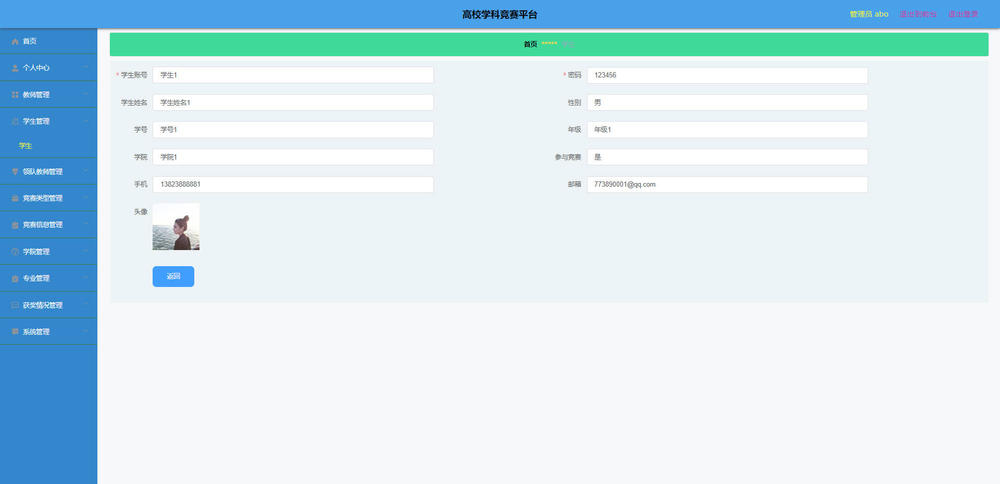


## 访问路径

### 前台

```properties
http://localhost:8080/springboot46869/front/pages/login/login.html

账号 学生6
密码 123456
```

### 后台

```properties
http://localhost:8080/springboot46869/admin/dist/index.html#/login

账号 abo
密码 abo
```


## 功能图

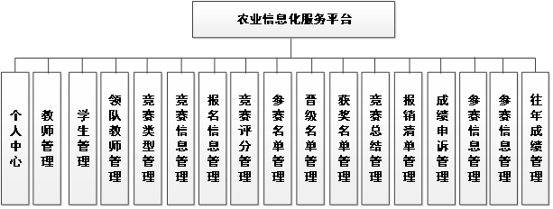


## 文档目录

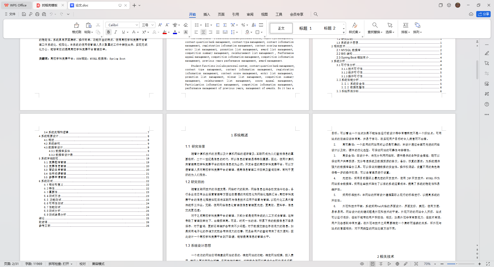


## 打赏或交流


